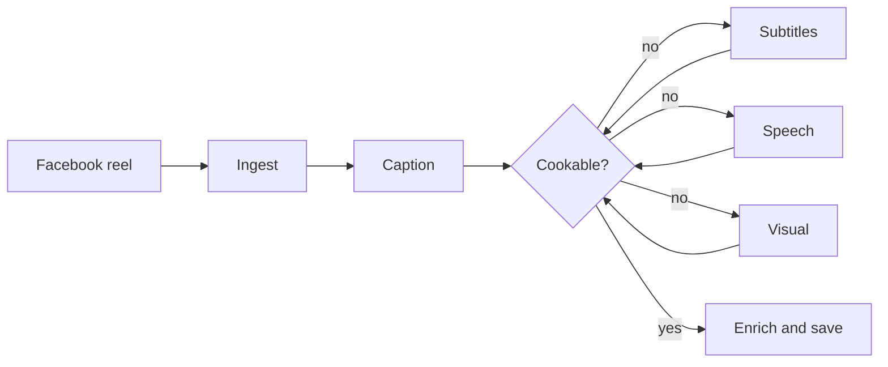
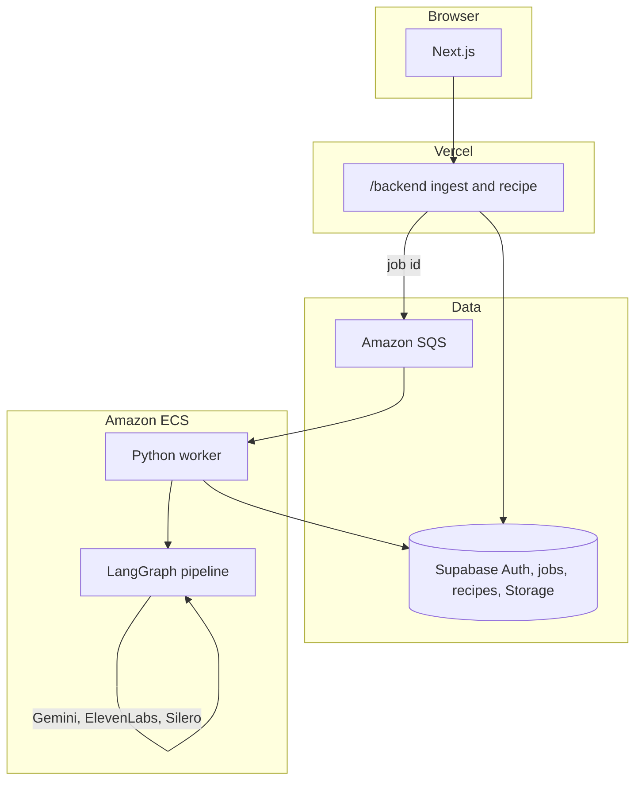

# Recipe Kitchen

Turn a Facebook cooking reel into a recipe card you can cook from.

Short videos bury the dish in captions, overlays, and speech, often in Burmese. Recipe Kitchen reads the post first, listens only when someone is talking, and watches the picture only when the text is still short of a method. It stops as soon as a home cook could recreate the dish.

It works for Burmese and English recipe videos.

## Story

I send my partner cooking reels, many of them in Burmese. Apps that already turn a video into a recipe card skip Burmese. That is a reasonable product choice: Burmese is a low-resource language, and off-the-shelf OCR and speech-to-text only partly support it.

This project is the workaround. I did not train an OCR or speech model. I chained models that already exist, and the chain stops when the extract is cookable. It is good enough to keep the recipes we actually cook. The choices behind that chain are below.

## How it works

Paste a Facebook reel URL while signed in. The app scrapes the post, then extracts a recipe from cheaper text first and spends on audio or video only when that text is still short of a method.



1. **Ingest.** Scrape the reel (Apify), store the video and thumbnail in Supabase Storage, and keep the caption and any subtitle track.
2. **Caption, then subtitles.** Pull ingredients and steps from post text. Skip marketing titles; keep lines that look like a method.
3. **Speech.** Silero VAD checks for speech. A silent track skips transcription. Otherwise ElevenLabs Scribe transcribes; Burmese is translated, both languages are kept, and the lines are merged.
4. **Visual.** Gemini watches a muted copy of the video for overlays, packaging labels, and cooking actions.
5. **Judge.** After each channel, Gemini decides whether a cook could recreate the dish from the extract so far. Amounts and times are optional. A missing major ingredient or a gap in the method is not.
6. **Enrich and save.** Name the dish, set cuisine and tags, audit ungrounded or generic names, then write the card to the user's library.

Later channels merge into earlier ones: one row per ingredient, later evidence wins, and an empty amount does not wipe a filled one.

## Architecture

Extraction is too slow and too expensive for a request that has to stay open. The UI only enqueues work. A worker does the rest.



- **Next.js** signs the user in with Supabase, allows three active jobs per user, inserts a `jobs` row, and puts the job id on SQS.
- **The worker** long-polls SQS, claims the row, runs ingest or the LangGraph extract, then marks the job succeeded or failed. SQS carries only the id. Payloads stay in Postgres.
- **Stored videos are deleted** after the pipeline so a reel does not sit in the bucket.

CI lints, type-checks, and tests on every push. A passing `main` build pushes a Docker image to ECR and rolls the ECS worker.

## Stack

| Layer | Choice |
| --- | --- |
| UI | Next.js, React, Tailwind |
| Auth and data | Supabase (Auth, Postgres, Storage) |
| Jobs | Amazon SQS, ECS worker |
| Extract graph | Python, LangGraph, Pydantic |
| Speech | Silero VAD, ElevenLabs Scribe v2 |
| Language and vision | Gemini 3.5 Flash Lite |
| Ingest | Apify Facebook scraper, ffmpeg |

## Design decisions

Each choice was checked on a small set of test reels. Scripts and notes live in `benchmark/`.

**Speech.** Google Cloud Speech-to-Text and ElevenLabs Scribe v2 transcribed the same Burmese reel, on the same chunks. Google returned jammed, mostly unreadable text. Scribe v2 returned a coherent Burmese transcript with usable timestamps. v2 shipped in January 2026, and ElevenLabs says it is more accurate and stable than Scribe v1. Their published Burmese figures agree in direction: v1 is 21.7% word error on FLEURS, and v2 places Burmese in the 10–20% band. Narration goes through Scribe v2.

**Both languages.** A Burmese caption or transcript is translated, then ingredients and steps are collected from the original and the English in parallel. When both sides mention the same item, the card uses the English name, amount, and instruction, and keeps the Burmese line as evidence. Ingredients pair on a shared timestamp when the transcript has one, and by order otherwise. Steps pair by order. A mention that exists in only one language stays on the card.

**On-screen text.** Tesseract includes Burmese, but the `mya` model in `tessdata` was last updated in March 2018, and the higher-accuracy `tessdata_best` file is from September 2017, so the package is about eight years old. On the stills that were compared, PaddleOCR recovered the overlays and Tesseract missed the full cooking frame. Still frames were the wrong unit for the pipeline. Burmese overlays mostly restated the narration. On one stylistic English reel, five ingredients flashed as text in about two seconds, and one frame per second kept two of them. Gemini watching a muted copy of the video also misses part of that flash, and it gives up fine control over which pixels become text. It earns the slot because it can name ingredients and follow cooking actions when nobody is narrating.

**Early stop.** The route is fixed: caption, then subtitles when the reel has them, then transcript, then video. After each stage, Gemini asks whether the extract is already a dish. The prompt treats ingredients as characters and steps as a story. Sufficient means the characters are present and a cook could follow the story without inventing a major ingredient or action. Amounts and times stay out of the judgment. On the test set, the judge stopped at the expected stage for every clip, so Scribe and the video pass stay off when the caption already holds the recipe.

**Speech detection.** Scribe was running on silent reels. Silero VAD checks for speech first and skips transcription when the track is quiet. It caught speech on the test videos, including reels whose soundtrack was music. Music can still register as speech; there is no extra filter for that. The cost is a CPU PyTorch dependency and a little latency, which is cheaper than calling ElevenLabs on a reel with no narration.

**Idle compute.** The first API was FastAPI on Fargate behind a load balancer: one service for ingest and job status, in containers I controlled. The tasks stayed up with no traffic, and extraction is too long to hold a request open. Next.js routes now write the job and send only the id to SQS. An ECS worker scales up when the queue has a message and back down when it is empty. Idle AWS is about $2–3 a month. FastAPI remains for local experiments. The public API is the Next.js routes.

## Local setup

You need **Python 3.14**, [uv](https://docs.astral.sh/uv/), **Node.js 20+**, **ffmpeg**, and filled-in credentials.

```bash
cp .env.example .env
uv sync --all-groups
cd frontend && npm install
```

Fill `.env` from `.env.example`. Keep `SUPABASE_SECRET_KEY`, SQS, and AWS keys on the server. The Next app maps `SUPABASE_URL` and `SUPABASE_PUBLISHABLE_KEY` to `NEXT_PUBLIC_*` for the browser.

Run the worker and the UI in two terminals:

```bash
uv run recipe-kitchen-worker
cd frontend && npm run dev
```

Open [http://localhost:3000](http://localhost:3000), sign in, and paste a Facebook reel URL.

The Python API is optional for local experiments:

```bash
uv run uvicorn recipe_kitchen.main:app --reload
```

## Tests

```bash
uv run ruff check .
uv run basedpyright
uv run pytest
```

## Layout

```
src/recipe_kitchen/   FastAPI app, LangGraph, worker, pipelines
frontend/             Next.js UI and job enqueue routes
supabase/schemas/     Postgres schema
benchmark/            STT, OCR, and VAD comparisons
tests/                Pytest
```
